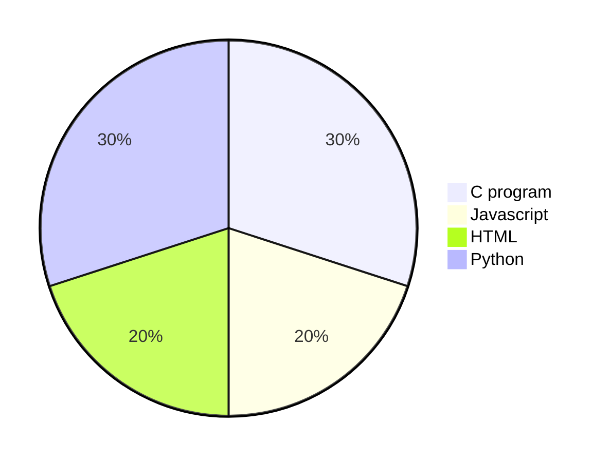

# Hola, I'm Velvet Brown👋

---------
- 🔭 I’m currently learning Python, Javascript, C programming Language
- 👀 I’m interested in Building and maintaing web apps, data analysis and V-ray Designs
- 🌱 I’m currently a student at ALX Africa
- 🤔 I’m looking for help with C programming
- 💞️ I’m looking to collaborate on Great and innovative projects with Great minds. Cheers to making a difference in our society
- 💬 You can reach me via twitter [@BountyKahuntee](https://twitter.com/BountyKahuntee) and linkedIn [@County](https://www.linkedin.com/in/onayemi555)
- 📫 You can also reach me via email at [@County](toonmynynoo279@gmail.com)
- 😄 Pronouns: **She**
- ⚡ Fun fact: I love coffee, beans and i am a chronic perfume fanatic

----------

### Languages and Tools:

                                                                                                                         

                                                                                                                                        
       

-----------

